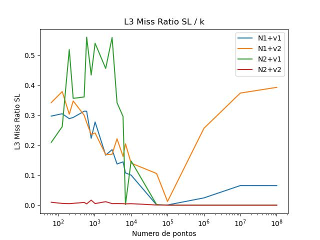
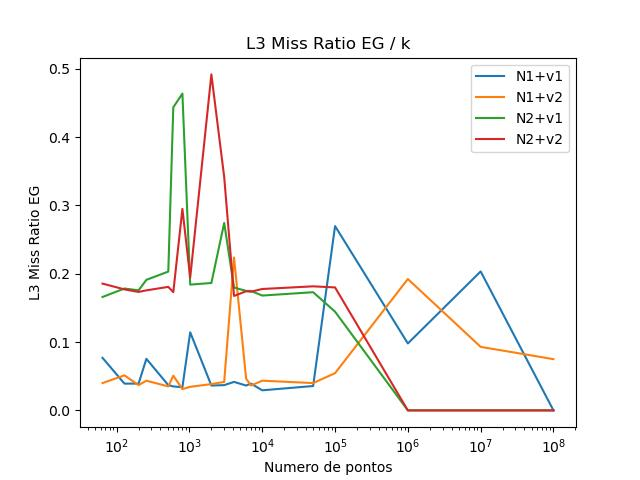
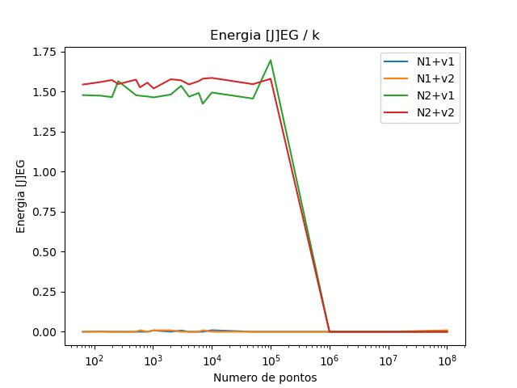
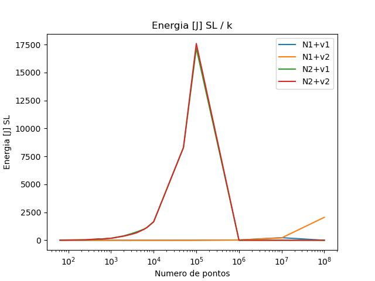
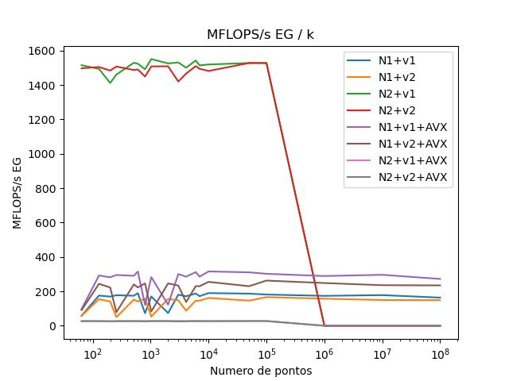
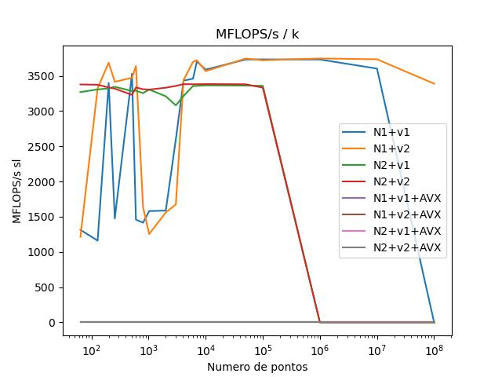
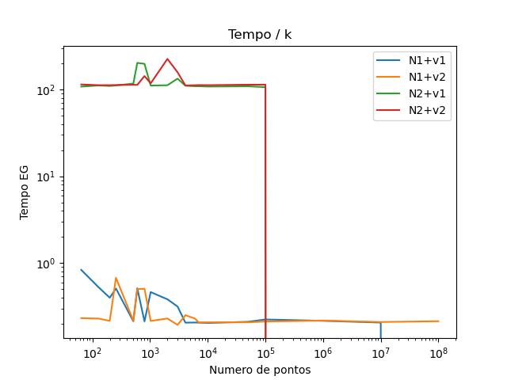
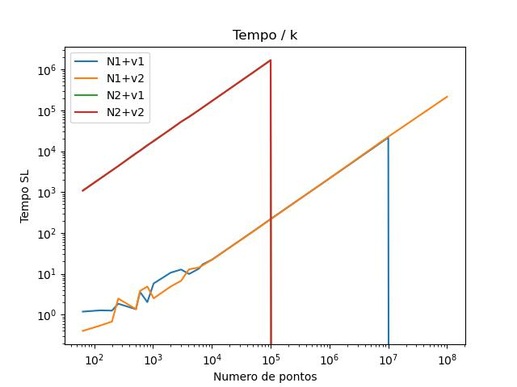

# Relatorio TP03
## Introdução
**Nicolas Andre Rizzardi** GRR20206152
Para o **EP03** eu utilizei a máquina **H42** disponível no **Lab12**

## Alterações
A primeira observação foi que para não utilizar toda a minha *quota* do **DINF** ao rodar o programa com `k=100000000` e`n=10`, eu comentei as funções que imprimiam em tela os valores dos resíduos e dos coeficientes, porém ao longo do desenvolvimento essas funções foram utilizadas para comparar os resultados das versões afim de garantir que não houvessem alterações significativas nos resultados dos programas.

Agora falando sobre o código:

Na função `montaSL`, primeiramente tentei fazer um *loop fusion* porém essa função acabou gerando uma complexidade maior no código ao tentar aplicar outras técnicas de otimização, então tentei também remover as custosas operações `pow()` colocando duas variáveis incrementais no entanto ao utilizar uma variável incremental o erro era transmitido quanto maior o número de pontos o que causou um erro de precisão absurdo no final, depois apliquei a técnica de *Unroll & Jam* que funcionou e além disso foi removido o stride do acesso à matriz, começando o laço pela variável **k**.

Já na função `eliminacaoGauss` a alteração se deu após o pivoteamento, aplicando novamente um *Unroll & Jam*. O pivoteamento foi uma função que não enxerguei como otimizar o seu *stride*, mudar a ordem de acesso à matriz pelo pivoteamento geraria um *stride* em todos os demais acessos à matriz.

A função `retrossubs` foi aplicado um *Unroll & Jam* e após isso não houveram outras possibilidades de otimização.

A última alteração veio na função `P`, onde eu apliquei a técnica de *Unroll & Jam* e também tentei remover a função `pow()` colocando uma variável incremental porém também não obtive sucesso pelos mesmos motivos já citados acima.

## Resultados
O script que eu utilizei foi feito em **Python3** muito por conta de ter a biblioteca `matplotlib` que facilita e muito a geração de gráficos e além de também ter facilidade para manipular strings.
### L3 Miss Ratio

Para o L3 Miss Ratio do MMQ a discrepância é muito grande entre as versões ***N2+V1*** e ***N2+V2***, onde a versão otimizada quase zera seu **Cache Miss**. Em contrapartida a versão otimizada de ***N1+V2*** quase não obteve vantagem e em muitas situações acabou por ser mais custoso para o programa.

O gráfico acima mostra que a versão ***N1+V2*** se mostra muito mais efetiva e constante do que a versão ***N1+V1***, enquanto que a otimização aplicada não gerou tanta vantagem para a versão ***N2+V2***. Porém é importante ressaltar que olhar para a taxa sem ter noção da quantidade total de ***Chache Miss*** entre as versões talvez seja um pouco insuficiente para afirmar vantagem ou desvantagem de uma versão em relação a outra.

### Energia [J]


A avaliação de Energia num geral é um pouco questionável, muitos dos valores testados não apresentaram custo de energia nem para o teste SL, enquanto para EG, apenas as versões **N2** tiveram algum custo de energia. O mais curioso é um outlier que se repete no teste de **n=10<sup>5</sup>** tanto para **N2+V1** quanto para **N2+V2**.

### MFLOPS/s



### Tempo


Para ambos os casos o tempo é muito semelhante havendo muita pouca diferença entre os casos de **N1+V1** e **N1+V2**, já para **N2+V1** e **N2+V2** literalmente não há diferença


## Topologia
```
--------------------------------------------------------------------------------
CPU name:	Intel(R) Core(TM) i5-7500 CPU @ 3.40GHz
CPU type:	Intel Coffeelake processor
CPU stepping:	9
********************************************************************************
Hardware Thread Topology
********************************************************************************
Sockets:		1
Cores per socket:	4
Threads per core:	1
--------------------------------------------------------------------------------
HWThread	Thread		Core		Socket		Available
0		0		0		0		*
1		0		1		0		*
2		0		2		0		*
3		0		3		0		*
--------------------------------------------------------------------------------
Socket 0:		( 0 1 2 3 )
--------------------------------------------------------------------------------
********************************************************************************
Cache Topology
********************************************************************************
Level:			1
Size:			32 kB
Type:			Data cache
Associativity:		8
Number of sets:		64
Cache line size:	64
Cache type:		Non Inclusive
Shared by threads:	1
Cache groups:		( 0 ) ( 1 ) ( 2 ) ( 3 )
--------------------------------------------------------------------------------
Level:			2
Size:			256 kB
Type:			Unified cache
Associativity:		4
Number of sets:		1024
Cache line size:	64
Cache type:		Non Inclusive
Shared by threads:	1
Cache groups:		( 0 ) ( 1 ) ( 2 ) ( 3 )
--------------------------------------------------------------------------------
Level:			3
Size:			6 MB
Type:			Unified cache
Associativity:		12
Number of sets:		8192
Cache line size:	64
Cache type:		Inclusive
Shared by threads:	4
Cache groups:		( 0 1 2 3 )
--------------------------------------------------------------------------------
********************************************************************************
NUMA Topology
********************************************************************************
NUMA domains:		1
--------------------------------------------------------------------------------
Domain:			0
Processors:		( 0 1 2 3 )
Distances:		10
Free memory:		2710.2 MB
Total memory:		7825.64 MB
--------------------------------------------------------------------------------


********************************************************************************
Graphical Topology
********************************************************************************
Socket 0:
+---------------------------------------------+
| +--------+ +--------+ +--------+ +--------+ |
| |    0   | |    1   | |    2   | |    3   | |
| +--------+ +--------+ +--------+ +--------+ |
| +--------+ +--------+ +--------+ +--------+ |
| |  32 kB | |  32 kB | |  32 kB | |  32 kB | |
| +--------+ +--------+ +--------+ +--------+ |
| +--------+ +--------+ +--------+ +--------+ |
| | 256 kB | | 256 kB | | 256 kB | | 256 kB | |
| +--------+ +--------+ +--------+ +--------+ |
| +-----------------------------------------+ |
| |                   6 MB                  | |
| +-----------------------------------------+ |
+---------------------------------------------+


```